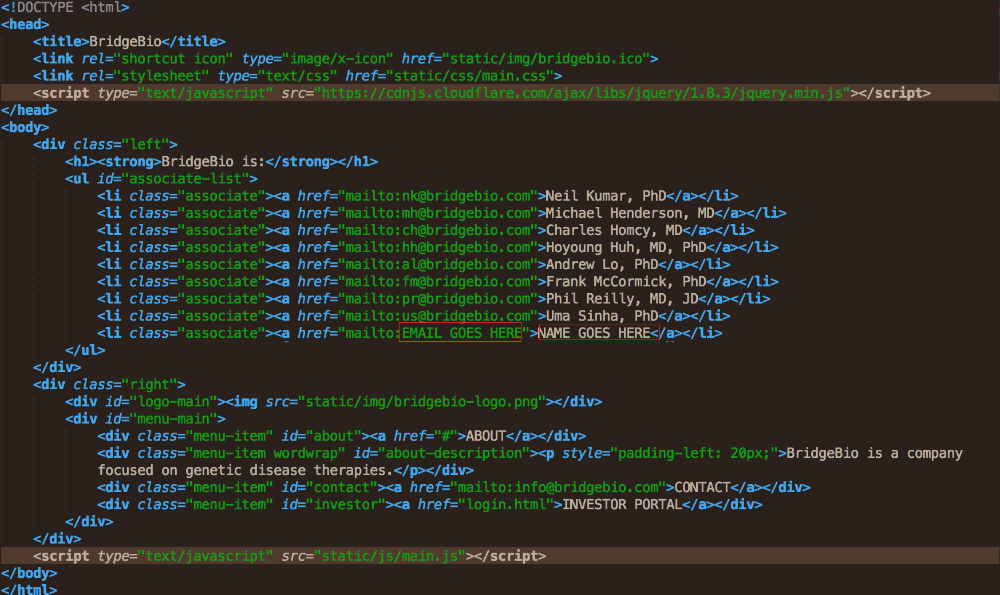

<h1>BridgeBio</h1>

This is the GitHub repository for the BridgeBio site.

<h3>Directions for updating list of associates:</h3>
<ol>
	<li>Open up the file index.html.</li>
	<li>In index.html, there is an html element called "associate-list"; within this element is a list of associate names and email links.</li>
	<li>Replace the areas labeled NAME GOES HERE and EMAIL GOES HERE in the image below with the according information.
		
	</li>
	<li>To maintain alphabetical ordering of names, copy and paste the updated line into the proper place in the list.</li>
	<li>Make sure all changes are saved on the GitHub account; the content on the GitHub account is what will be seen on the live site.</li>
</ol>

If you have any questions, feel free to reach out to kevin.j.guh.16@dartmouth.edu.
